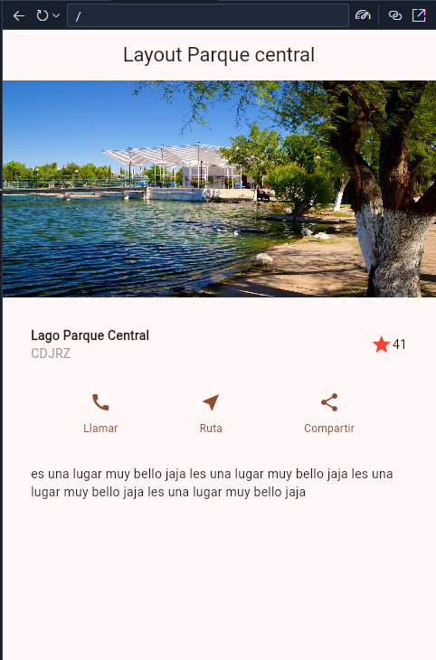

- https://github.com/sharon-atim/flta-materials.git

- Referencias
- [Ejemplo de layout](https://github.com/flutter/website/blob/main/examples/layout/lakes/interactive/lib/main.dart)

- Es Flutter
[Es Flutter Oficial](https://docs.flutter.dev/ui/layout/tutorial)

salida
